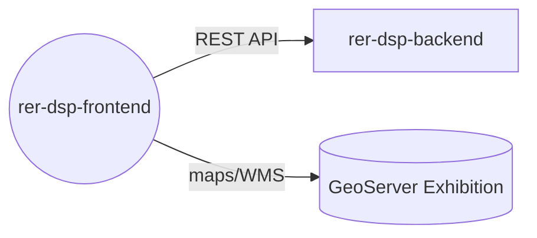

# rer-dsp-frontend

> This repository is one module of the **DSP (Data Sharing Platform)**, part of the RER ecosystem.
> Full project documentation lives in **[rer-dsp-docs](https://github.com/Rural-Environmental-Registry/rer-dsp-docs)**.
> The information below covers this module only, not the DSP project as a whole.

## Where this module fits in the DSP



Downloads go through the backend API (which uses GeoServer Download). The map frontend talks only to GeoServer Exhibition.

## Purpose

Web interface for viewing and sharing rural environmental data among RER partner institutions.

## Responsibilities

- Display environmental data and maps (WMS layers)
- Consume the `rer-dsp-backend` REST API
- Provide the DSP platform user experience

## Technologies

Vue 3, Vite, TypeScript, Tailwind CSS.

## How to run

```bash
npm install
npm run dev
```

Or, preferably, via `rer-dsp-core` (`./start.sh`), which starts the full stack.

## License

[GNU General Public License v3.0](LICENSE)
